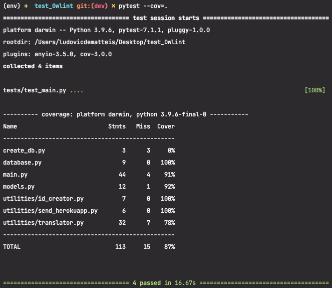

# test_Owlint

## Installation and configuration

### Clone and install the API

1. clone the repository to your local machine

`
$ git clone https://github.com/Ldm3110/test_Owlint.git
`

2. Go to the project folder

`
$ cd test_Owlint
`

3. Create the virtual environment and activate it

`
$ python -m venv env && source/env/bin/activate
`

4. Install the requirements

`
$ pip install -r requirements.txt
`

### Configurate the database

This API works with a postgreSQL database, you must create one. After the creation you must export information to connect the API to this database.

`
$ export DB_USER={your postgreSQL username}
$ export DB_PASSWORD={your postgreSQL password}
$ export DB_NAME={the name of your database}
`

Now you can connect the API with this database 

`
$ python create_db.py
`

## Use the API

To run the API, use uvicorn

`
$ uvicorn main:app
`

To use the API, you can use POSTMAN, Insomnia or other platform

You find the documentation of this API at this address

**https://documenter.getpostman.com/view/18365116/UVyrVH12**

## Tests and coverage

The test coverage is 87% of the entire code

You can also do a flake8 test 

`
$ flake8
`